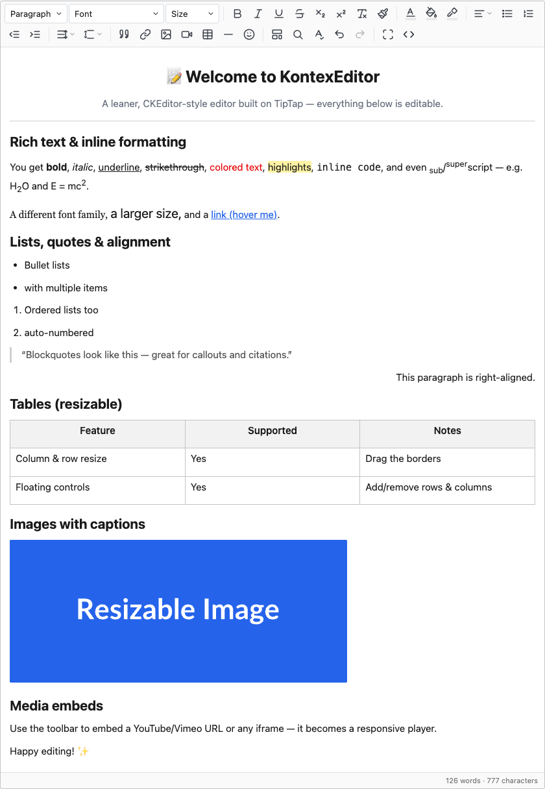

<div align="center">

# KontexEditor

**A lightweight, embeddable rich-text editor with a CKEditor-style UX — built on [TipTap](https://tiptap.dev) / ProseMirror.**

[](LICENSE) [](https://tiptap.dev) [](#what-to-distribute) [](#) [](#contributing)

Drop-in friendly, framework-agnostic, and self-contained — one `<script>` and you have a full editor.



</div>

---

## Table of contents

- [Why KontexEditor](#why-kontexeditor)
- [Features](#features)
- [Demo](#demo)
- [Installation](#installation)
- [Quick start](#quick-start)
- [Configuration](#configuration)
- [API](#api)
- [Custom toolbar](#custom-toolbar)
- [Common recipes](#common-recipes)
- [Framework integration](#framework-integration)
- [What to distribute](#what-to-distribute)
- [Browser support](#browser-support)
- [Development](#development)
- [Contributing](#contributing)
- [License](#license)
- [Acknowledgements](#acknowledgements)

## Why KontexEditor

CKEditor 5 is powerful but heavy, and its modern builds can be awkward to embed and
license. KontexEditor keeps the **familiar CKEditor-style toolbar and UX** your users
already know, while shipping a **much smaller, self-contained** editor under the hood:

- **One file, no build step** — a single UMD `<script>` (~167 KB gzipped) that injects its
  own CSS. Works in any server-rendered app (PHP, Rails, Django, plain HTML).
- **Form-friendly** — binds to a `<textarea>` and keeps it in sync, so a normal form
  submit "just works" (CKEditor-style).
- **Framework-agnostic** — the same core powers React/Vue/Svelte wrappers; ESM build for
  bundlers.
- **MIT licensed** — no seat/usage licensing.

## Features

- **Core formatting** — bold, italic, underline, strikethrough, sub/superscript,
  headings, font family, font size, text/background colour, highlight, links, inline
  code, clear formatting, and a **format painter** (copy character *and* paragraph
  formatting).
- **Paragraph** — alignment dropdown, bullet/ordered lists, blockquote, indent/outdent
  (**Tab / Shift-Tab**), line spacing, paragraph spacing, horizontal rule.
- **Tables** — insert, **column *and* row resizing**, and floating context controls
  (add/delete row & column, merge/split, header row, delete).
- **Media** — resizable images with **editable captions**, alignment, **drag-and-drop /
  paste** upload, and responsive video/iframe embeds (YouTube/Vimeo URL normalisation).
- **Links** — insert/edit popup plus a **hover bubble** (open · edit · unlink).
- **Spell check** — dictionary-backed (Hunspell via `nspell`) with red underlines and a
  custom right-click suggestion menu. The dictionary is **lazy-loaded** on first use, so
  it costs nothing until enabled.
- **Productivity** — find & replace, templates/snippets menu, special-character & emoji
  picker, source/HTML view, **Word/Office paste cleanup**, full-screen mode, live
  word/char count.
- **Comfort** — **autosave to `localStorage`** with a "Saved" indicator, read-only mode,
  fast custom tooltips.

## Demo

The screenshot above is the bundled demo. To run it yourself:

```bash
npm install
npm run build        # produces dist/
npm run dev          # then open http://localhost:5173/demo.html
```

`demo.html` preloads rich sample content so you can try every feature (resize a table,
drop in an image, run spell-check, use the format painter, go full-screen, …).

## Installation

### Plain `<script>` (UMD — no build step)

```html
<textarea name="body"><p>Preloaded HTML…</p></textarea>

<script src="kontex-editor.umd.cjs"></script>
<script>
  KontexEditor.create('textarea[name=body]', {
    placeholder: 'Start typing…',
    onChange: (html) => console.log(html),
  });
  // The textarea is hidden and kept in sync — a normal form submit posts the HTML.
</script>
```

### npm / bundler (ESM)

```bash
npm install kontex-editor
```

```js
import { create } from 'kontex-editor';

const editor = await create('#editor', { content: '<p>Hello</p>' });
```

The package ships ESM, UMD, and TypeScript declarations, wired via the `exports` field so
your bundler resolves the right one automatically.

## Quick start

`KontexEditor.create(target, options?)` returns a `Promise` resolving to the editor
instance. `target` is a CSS selector or an element.

```js
const editor = await KontexEditor.create('#editor', {
  content: '<p>Hello world</p>',
  placeholder: 'Start typing…',
  onChange: (html) => save(html),
});

editor.getHTML();        // current content
editor.setHTML('<p>…');  // replace content
editor.destroy();        // tear down
```

| Target | Behaviour |
|---|---|
| a `<textarea>` | Hidden and kept **in sync** — normal form submits post the HTML. |
| any element (`<div>`) | The editor mounts inside it; read content via `getHTML()` / `onChange`. |

## Configuration

| Option | Type | Description |
|---|---|---|
| `content` | `string` | Initial HTML. Falls back to the textarea's value / element HTML. |
| `placeholder` | `string` | Placeholder shown when empty. |
| `editable` | `boolean` | Start editable (default `true`) or read-only. |
| `toolbar` | `ToolbarItem[]` | Custom toolbar layout. `[]` hides the toolbar. |
| `upload` | `{ url, fieldName? }` \| `(file) => Promise<string>` | Image upload handler. Omit to disable uploads (URL embed still works). |
| `spellcheck` | `boolean` | Start with the dictionary spell-checker on (default `false`; toggle from the toolbar). |
| `dictionary` | `{ affixUrl, dictionaryUrl }` | Override the dictionary source (defaults to a CORS-enabled en_US on jsDelivr). |
| `templates` | `TemplateDef[]` | Content blocks for the Templates menu. |
| `autosave` | `{ key, debounceMs?, restore? }` | Persist to `localStorage[key]` as the user types; `restore: true` reloads the draft on init. |
| `onChange` | `(html, editor) => void` | Fires on every change with the current HTML. |
| `onReady` / `onFocus` / `onBlur` | `(editor) => void` | Lifecycle callbacks. |

## API

```js
editor.getHTML();          // current content as HTML (store/submit this)
editor.setHTML(html);      // replace content
editor.getJSON();          // TipTap/ProseMirror document
editor.getText();          // plain text
editor.isEmpty();          // boolean
editor.characters();       // number
editor.words();            // number
editor.focus(); editor.blur();
editor.setEditable(bool);  // toggle read-only
editor.destroy();          // unmount, restore the original textarea/element
editor.tiptap;             // the underlying TipTap Editor, for advanced use
```

## Custom toolbar

Pass any subset/order of items (`|` is a separator):

```js
KontexEditor.create('#editor', {
  toolbar: [
    'heading', 'fontSize', '|',
    'bold', 'italic', 'underline', '|',
    'fontColor', 'highlight', '|',
    'align', 'bulletList', 'orderedList', '|',
    'link', 'image', 'table', 'findReplace', '|',
    'fullscreen', 'source',
  ],
});
```

**Available items:** `heading`, `fontFamily`, `fontSize`, `bold`, `italic`, `underline`,
`strike`, `subscript`, `superscript`, `clearFormat`, `formatPainter`, `fontColor`,
`bgColor`, `highlight`, `align` (or `alignLeft` / `alignCenter` / `alignRight` /
`alignJustify`), `bulletList`, `orderedList`, `indent`, `outdent`, `lineSpacing`,
`paragraphSpacing`, `blockquote`, `link`, `image`, `media`, `table`, `horizontalRule`,
`specialChar`, `template`, `findReplace`, `spellcheck`, `fullscreen`, `undo`, `redo`,
`source`, `|`.

## Common recipes

**Image uploads** — the editor `POST`s `multipart/form-data`; respond with the hosted URL
(`{ url }`, `{ location }`, or a bare string):

```js
KontexEditor.create('#editor', {
  upload: { url: '/api/upload' },              // endpoint
  // or a custom function:
  // upload: async (file) => (await myUploader(file)).url,
});
```

**Autosave & restore:**

```js
KontexEditor.create('#editor', {
  autosave: { key: 'draft:article-42', restore: true },
});
```

**Templates:**

```js
KontexEditor.create('#editor', {
  templates: [
    { title: 'Signature', description: 'Closing block', html: '<p>Best regards,<br>Me</p>' },
  ],
});
```

> ⚠️ **Security:** `getHTML()` returns raw user HTML. **Sanitize it on the server**
> (allowlist) before storing or rendering it anywhere. The paste cleanup is a UX nicety,
> not a security boundary. See the [Integration Guide](INTEGRATION.md#13-security-sanitize-on-the-server).

## Framework integration

Ready-to-copy components for **React, Vue 3, Svelte**, and **server-rendered forms**,
plus deeper guidance on uploads, spell-check, autosave, theming, and security, live in the
**[Integration Guide →](INTEGRATION.md)**.

## What to distribute

For a plain `<script>` integration you only need **one file**:

- **`dist/kontex-editor.umd.cjs`** — fully self-contained (all dependencies bundled, CSS
  injected at runtime). The `.map` is optional (debugging only).

Publishing to npm for bundler apps ships the whole `dist/` (ESM + UMD + `.d.ts`).

> The spell-check dictionary is fetched from a CDN at runtime and is **not** bundled — for
> offline use, self-host it and set the `dictionary` option.

## Browser support

Modern evergreen browsers (Chrome, Edge, Firefox, Safari). Requires standard DOM APIs
(`fetch`, `FileReader`, and `localStorage` for autosave). No Internet Explorer support.

## Development

Requires **Node.js ≥ 18**.

```bash
npm install
npm run dev        # dev playground + HMR at http://localhost:5173
npm run build      # dist/ — ESM + UMD + .d.ts
npm run typecheck  # type-check without emitting
```

Source lives in [`src/`](src/); custom TipTap extensions are in
[`src/extensions/`](src/extensions/) and the spell checker in
[`src/spellcheck/`](src/spellcheck/).

## Contributing

Contributions are welcome! To get started:

1. Fork and clone the repo, then `npm install`.
2. Create a branch: `git checkout -b feat/my-feature`.
3. Make your change; keep `npm run typecheck` clean and test in the demo
   (`npm run dev` → `/demo.html`).
4. Commit with a clear message and open a pull request describing the change.

Please keep the project's goals in mind — **lightweight, self-contained, and framework-
agnostic**. New heavyweight dependencies should be justified (and ideally lazy-loaded).
For larger features or questions, open an issue first to discuss.

## License

[MIT](LICENSE) © KontexEditor contributors.

## Acknowledgements

Built on the excellent work of:

- [TipTap](https://tiptap.dev) and [ProseMirror](https://prosemirror.net/) — the editor core
- [nspell](https://github.com/wooorm/nspell) & [dictionary-en](https://github.com/wooorm/dictionaries) — spell checking
- Icons in the style of [Lucide](https://lucide.dev)
